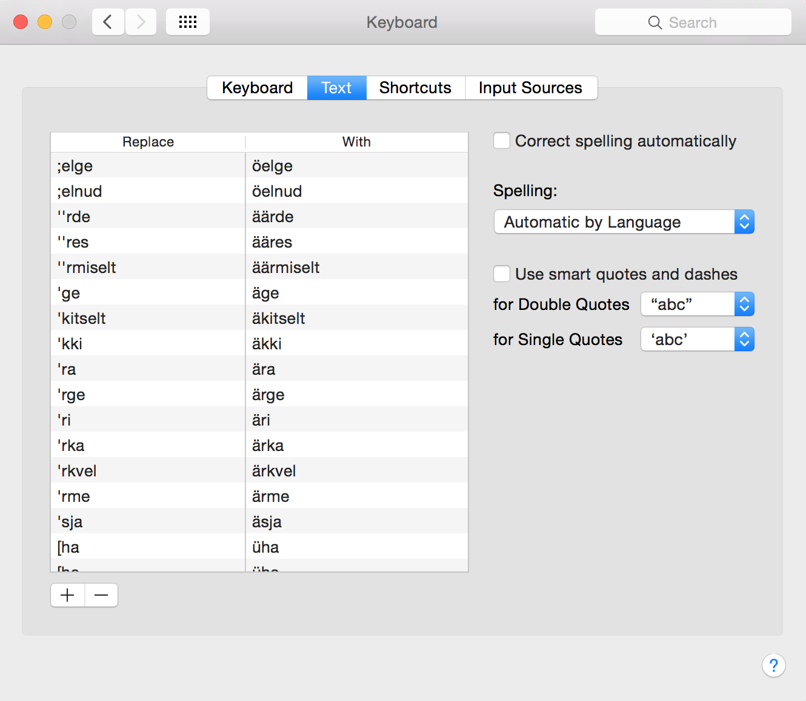
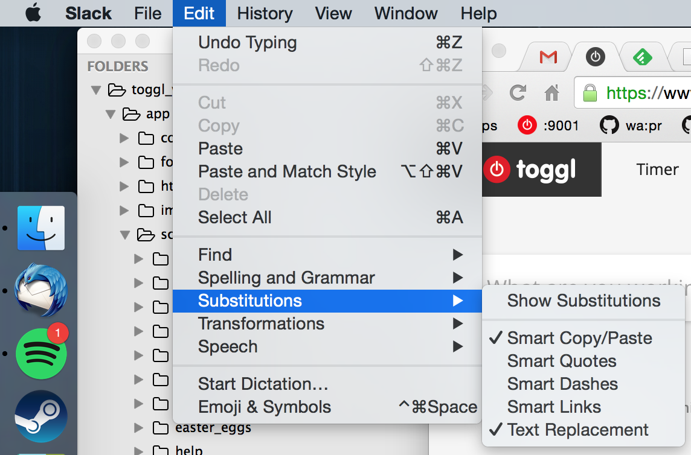

# Auto-expand estonian words with accented characters on OSX when using an english keyboard layout

I use en-US keyboard layout for development and otherwise typing but it's difficult to switch between english and estonian
layouts all the time (using estonian for chatting).

This is a helper to import a bunch of estonian words into a snippet system and
be able to type estonian with an english keyboard layout. The location of the accented characters is the same as they
would be if we were using the estonian layout'

e.g. `h'sti` -> `hästi`, `k]ik` -> `kõik`, `n[[d` -> `nüüd`, `;;` -> `öö`
Also supports sh and zh (I mean those weird estonian characters, not shell and zsh).

Supported snippet systems:
- MacOS's built-in snippets (you can find those under settings)
- Autohotkey on Windows (with Ubuntu Linux subsystem for running the commands for .ahk file generation)

## Sad trombone

It turns out though that there are about 100,000 words containing accented characters in Estonian (including cases and whatnot).
Including all of those **crashes the osx's keyboard settings view** and apps like TextEdit.

So we're using the 1000 most common words. On Windows we can use more: limit set at 50,000.

Full list of estonian words with frequencies from:

  https://invokeit.wordpress.com/frequency-word-lists/

Also, it appears that osx's built-in text replacement feature is **not system wide** but only supports a handful of apps
(why am I not surprised). So it doesn't work for chrome for example. Fortunately, though, it works for Slack app, which is why I need it mostly.

## Usage (MacOS)

1. Run `./extract_accented_words_mac.sh`.
  This generates `words.txt` which contains all the words that will be included.

2. Run `./import_csv_mac.sh ~/Library/Dictionaries/CoreDataUbiquitySupport/<some hash here>/UserDictionary/local/store/UserDictionary.db`.
  This imports all the words, generates a temporary csv file and imports it into osx's auto-expand db file, ignoring all metadata (like created-at date). Also runs `killall AppleSpell` to force-reload the spelling service.

3. Profit. The auto-expand list now contains all the words: 

4. Also make sure `Text Replacement` is enabled in the given app. Under `Edit` menu or run `defaults write -g WebAutomaticTextReplacementEnabled -bool true` to enable it for all apps (the definition of "all" is unknown in this case though). If there's no such option in the `Edit` menu then I'm sorry, you're shit out of luck. 

You need to pass in the location of the dictionary db file to the last command. In Yosemite it's found in `~/Library/Dictionaries/CoreDataUbiquitySupport/<some hash here>/UserDictionary/local/store/UserDictionary.db`. This is an sqlite3 database file. A backup is made in bak/ and it won't be overwritten but subsequent calls to `import_csv.sh`.

Note: Only supports lowercase words because osx's auto-expand is case insensitive and the snippets are used in
unknown order so there's no way to force it to use the uppercase version if you type an uppercase letter first. (`H'sti` vs `h'sti`)

## Usage (Windows with Ubuntu Linux Subsystem)

1. Run `./extract_accented_words_win.sh`.
  This generates `eesti_accent_autoexpand.ahk` with direct matches.

2. Profit. Run the ahk file (with autohotkey installed) and you should be able to speak Estonian.
